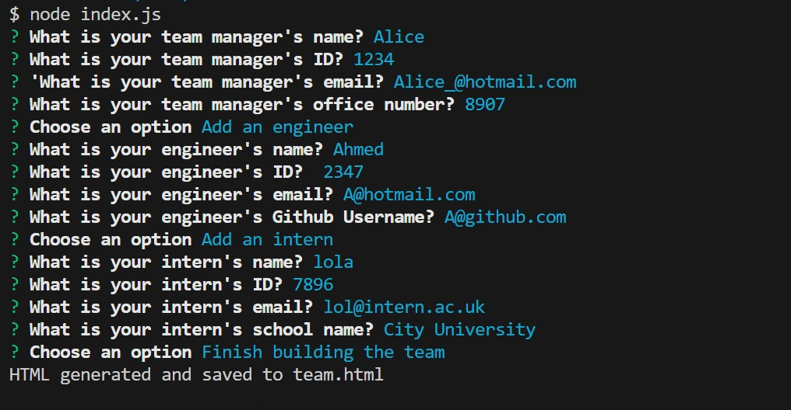
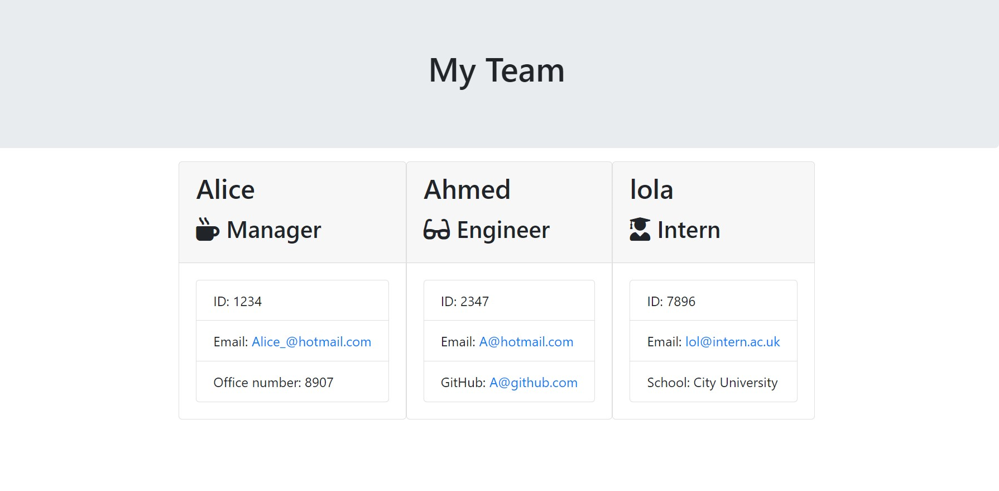
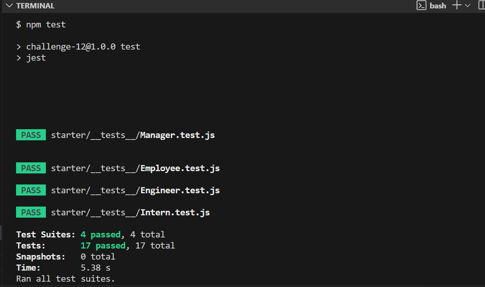

# Team-profile-generator

## Description
This Node.js command-line application allows managers to easily generate an HTML webpage displaying essential information about their software engineering team. The application uses classes for team members (Employee, Manager, Engineer, Intern), validating user input to ensure proper formatting. The inquirer package is used to gather information about team members, creating objects based on class blueprints.

## Table of Contents

* [Installation](#installation)
* [Usage](#usage)
* [Credits](#credits)
* [License](#license)
* [Testing](#testing)

## Installation

1) git clone git@github.com:username/repo.git
2) Change into project's directory
3) Start application on VS code

Note: 
* Uses inquirer package.
* Uses jest package.
* Must already have node.js installed.

## Usage 

1) Open application on vs code and in terminal and make sure in the starter directory and run programme by typing node index.js and answer the questions to generate readMe file in the output folder.

## Credits

Copyright © 2023 Sumayyah Akther Emama. All Rights Reserved.

## License

License under MIT

## Testing

Ensure have downloaded jest package 

* To check tests, type npm test in the terminal of the directory.

